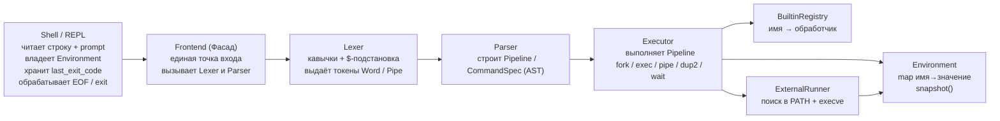
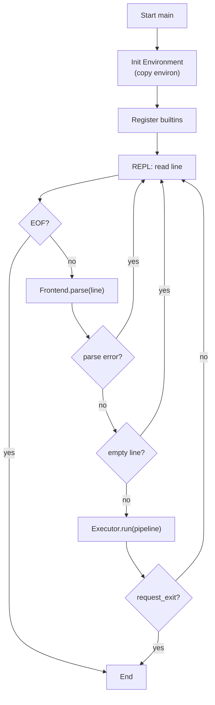
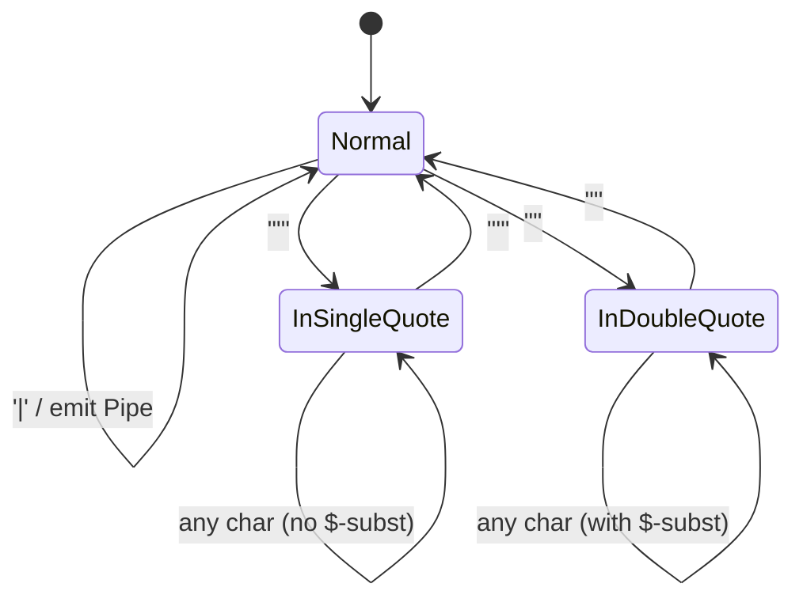
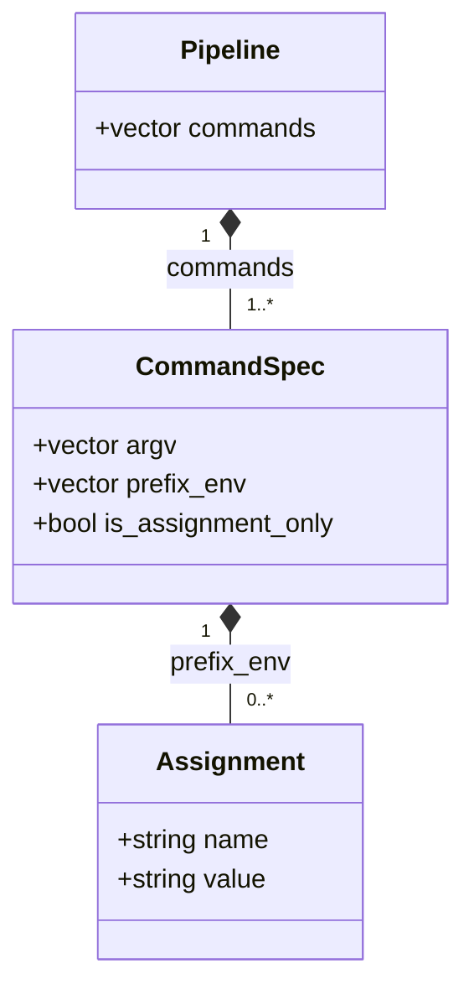
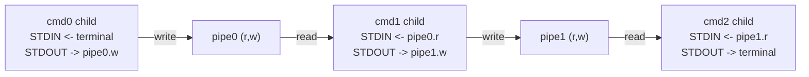
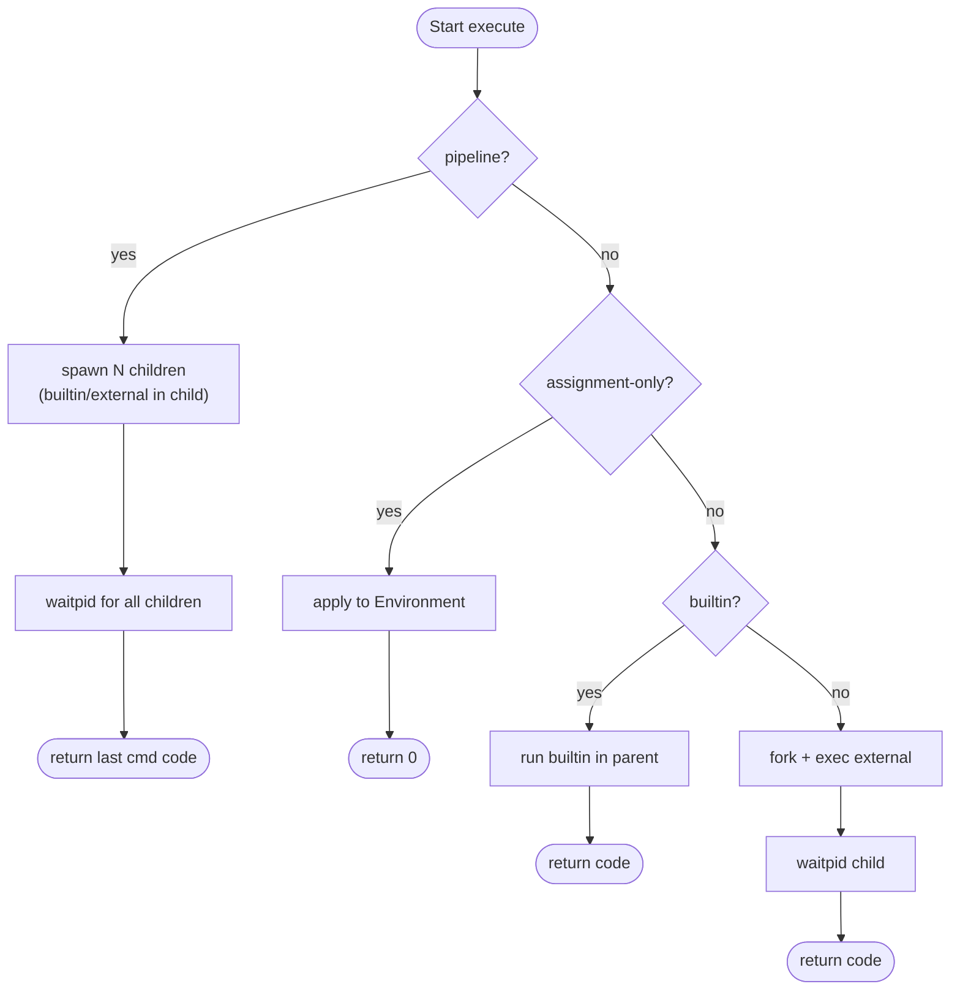

# Diagrams Source (Mermaid)

---

## 1. Component Diagram

Диаграмма компонентов показывает общую архитектуру интерпретатора и распределение ответственности между основными частями системы.  
**Shell (REPL)** является точкой входа и управляет жизненным циклом приложения, окружением и кодами возврата.  
**Frontend** объединяет лексический и синтаксический анализ.  
**Lexer** выполняет разбор строки на токены с учётом кавычек и подстановок переменных.  
**Parser** строит объектное представление команды (AST).  
**Executor** отвечает за исполнение пайплайнов, создание процессов и работу с файловыми дескрипторами.  
**BuiltinRegistry** и **ExternalRunner** реализуют соответственно встроенные и внешние команды.  
**Environment** хранит переменные окружения и предоставляет их снимок для запуска процессов.

---

## 2. Main Flow

Диаграмма основного потока исполнения описывает жизненный цикл программы от запуска до завершения.  
После инициализации окружения и регистрации встроенных команд приложение входит в цикл **REPL**: читает строку ввода, выполняет её разбор и исполнение.  
При ошибке разбора или пустой строке цикл продолжается.  
Если команда запрашивает завершение (`exit`) или встречается **EOF**, цикл прерывается, и процесс завершается с последним кодом возврата.

---

## 3. Lexer State Machine

Диаграмма автомата лексического анализатора иллюстрирует правила разбора входной строки на слова и операторы.  
Lexer различает обычный режим, одинарные и двойные кавычки.  
В одинарных кавычках подстановки переменных отключены, в двойных — разрешены.  
При формировании токена слова выполняется `$`-подстановка и отслеживается наличие незакавыченного символа `=`, что позволяет позже корректно распознавать присваивания.  
Пустые кавычки формируют пустой аргумент, а не удаляются.

---

## 4. AST Structure

Диаграмма структуры **AST** показывает объектное представление результата синтаксического анализа.  
**Pipeline** содержит одну или несколько команд, каждая из которых описывается структурой **CommandSpec**.  
Команда включает список аргументов, возможные префиксные присваивания переменных окружения и флаг «только присваивание».  
Такое представление отделяет этап разбора от этапа исполнения и позволяет **Executor** принимать решения о способе запуска команды.

---

## 5. Pipes / FD

Диаграмма пайплайна демонстрирует взаимодействие процессов через файловые дескрипторы.  
Для **N** команд создаётся **N−1** канал, и каждый дочерний процесс получает перенаправленные стандартные потоки ввода и вывода через `dup2`.  
Родительский процесс закрывает неиспользуемые концы каналов и ожидает завершения всех дочерних процессов.  
Такой механизм обеспечивает передачу данных между командами так же, как в традиционных Unix-shell.

---

## 6. Builtin vs External

Диаграмма выбора способа исполнения команды описывает логику **Executor**.  
Если выполняется пайплайн, каждая команда запускается в отдельном дочернем процессе, независимо от того, является ли она встроенной или внешней, после чего родитель ожидает завершения всех процессов и возвращает код последней команды.  
Для одиночной команды возможны три случая: присваивание переменных окружения (выполняется в родителе), встроенная команда (выполняется в родителе для возможности изменения состояния shell) и внешняя программа (запускается через `fork` и `execve` с последующим `waitpid`).

